# Lab5Web
Praktikum 5 Mempelajari Javascript pada HTML, dan juga membuat Script Untuk Validasi Form
### Membuat Console log pada HTML
>> Buatlah file html bernama _lab5_javascript.html_ dan Kita masukkan Kode Berikut :

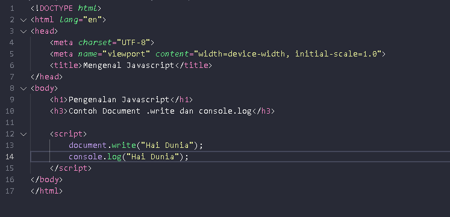
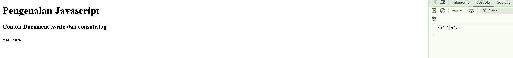

## Javascript Dasar
### Memakai Alert sebagai Properti Window.
>> Masukkan Kode berikut pada file _lab5_javascript.html_ :

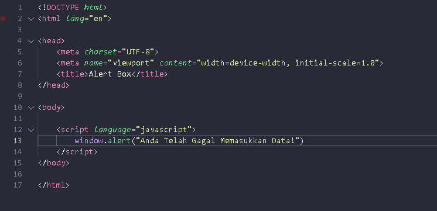
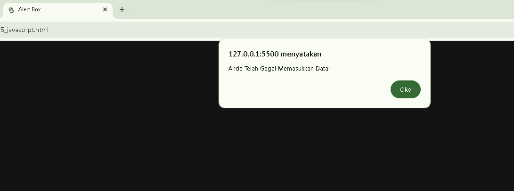

### Pemakaian Method dalam Objek
>> Masukkan Kode berikut pada file _lab5_javascript.html_ :

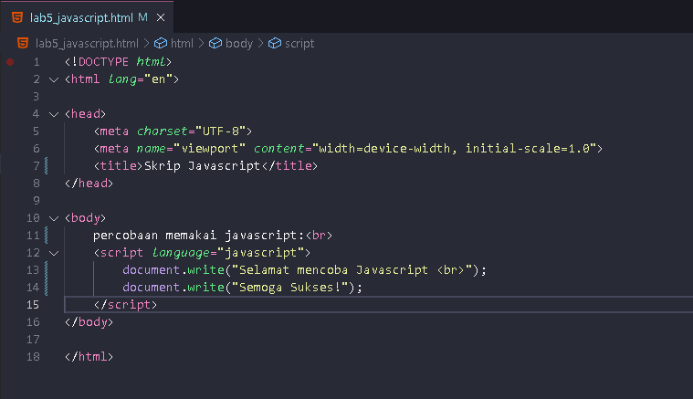
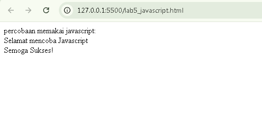

### Pemakaian Prompt pada Javascript
>> Masukkan Kode berikut pada file _lab5_javascript.html_ :

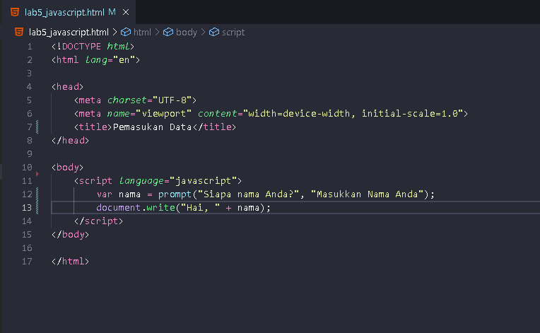
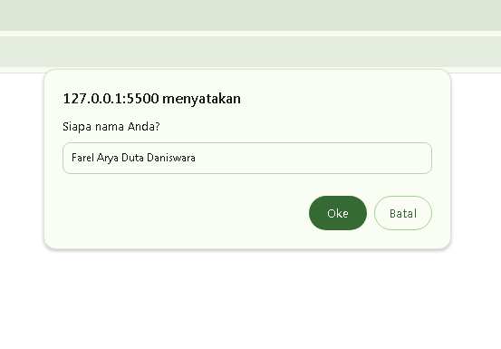
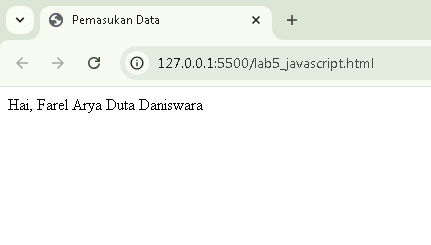

### Pembuatan Fungsi dan Cara Untuk Memanggil Fungsi Tersebut
>> Masukkan Kode berikut pada file _lab5_javascript.html_ :

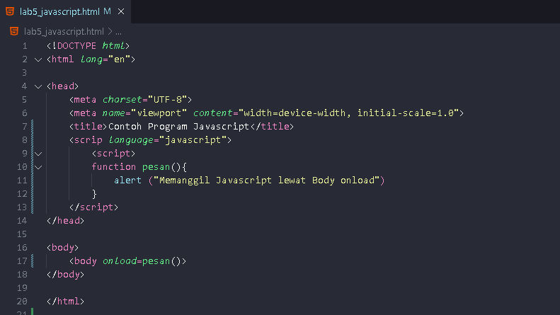
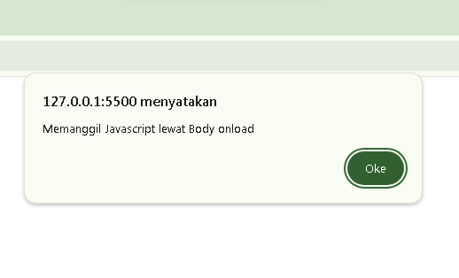

### Operasi Dasar Aritmatika
>> Masukkan Kode berikut pada file _lab5_javascript.html_ :

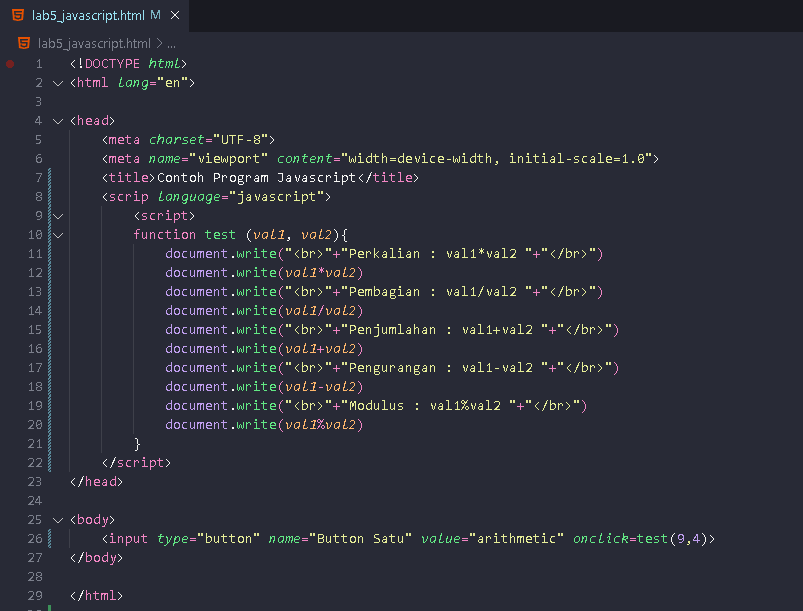
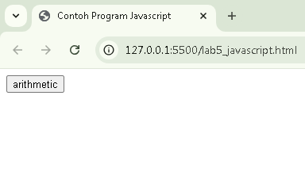
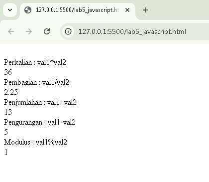

### Seleksi Kondisi (IF - Else)
>> Masukkan Kode berikut pada file _lab5_javascript.html_ :

Ketika di Input Nilai Lebih atau Sama dengan 65 akan memunculkan pesan "Hasil Lulus!"
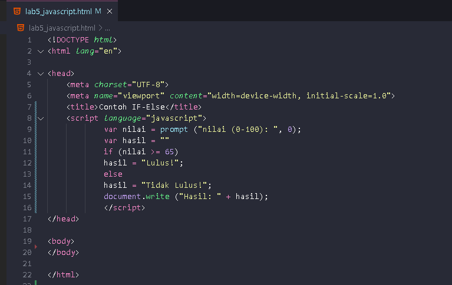
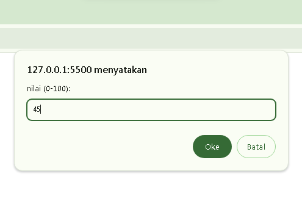
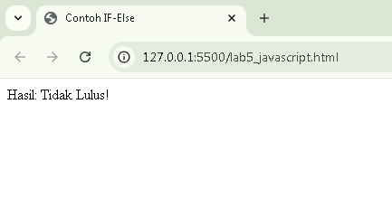

### Penggunaan Operator Switch untuk seleksi Kondisi
>> Masukkan Kode berikut pada file _lab5_javascript.html_ :

Ketika di Input Bilangan lain diluar 1 sampai 5 dia akan mengeluarkan pesan "Bilangan lainnya"
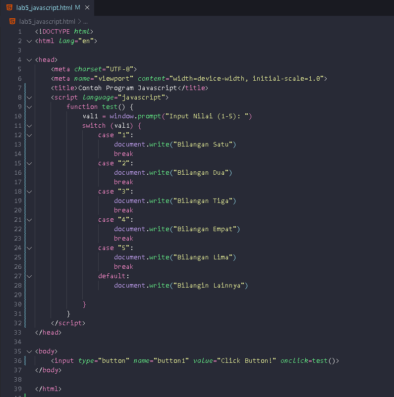
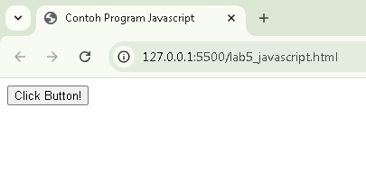
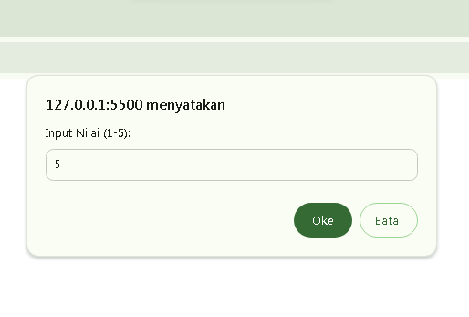
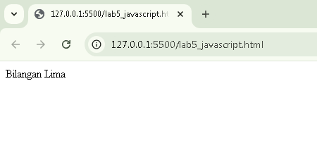

## Pembuatan Form
### Form Input
>> Masukkan Kode berikut pada file _lab5_javascript.html_ :

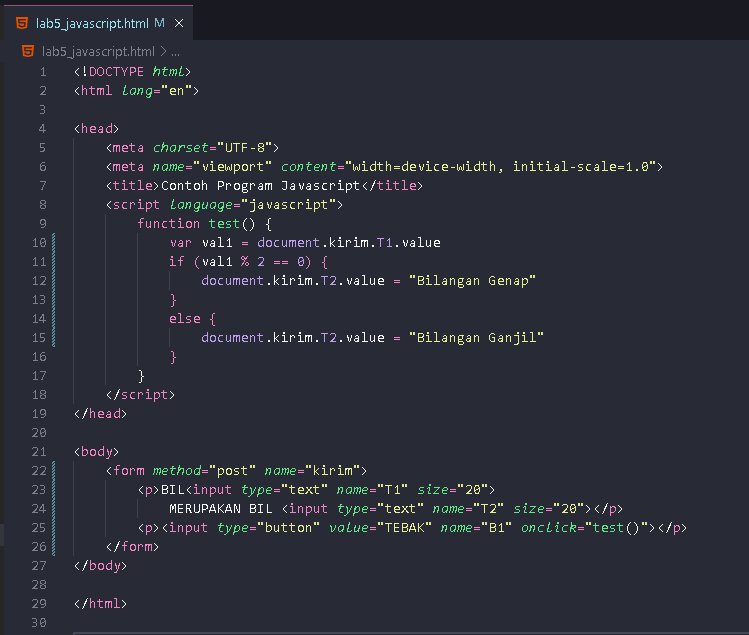
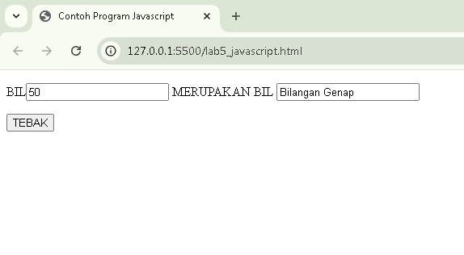

### Form Button
>> Masukkan Kode berikut pada file _lab5_javascript.html_ :

Ketika Button Button ini Dipencet, Misalnya Button "Latar Belakang Hijau" Dipencet akan Merubah Latar Belakang Web Menjadi Hijau sama hal nya dengan memencet Button "Latar Belakang Putih" dan Juga untuk Button "Teks Kuning" akan merubah warna teks pada web menjadi kuning sama hal nya dengan memencet button "Teks Biru"
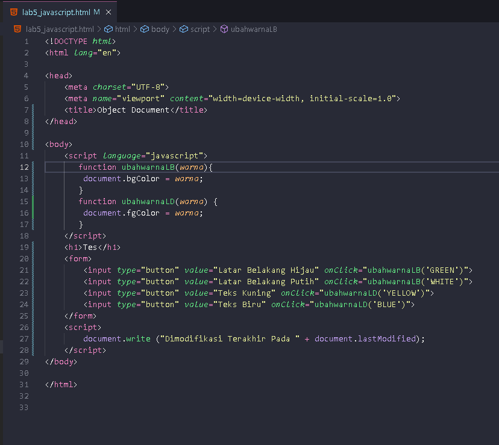
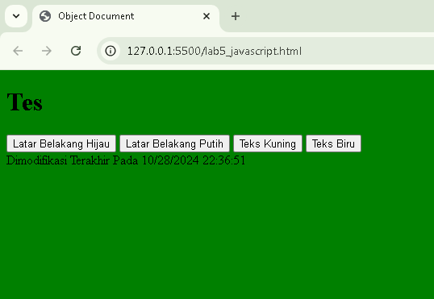
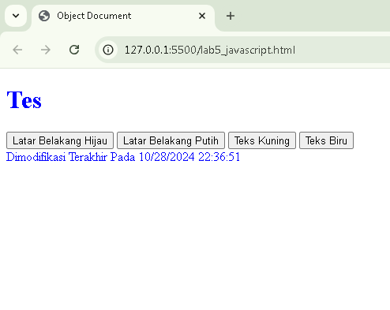

### Pilihan Menggunakan Checkbox dengan Perhitungan Otomomatis
>> Masukkan Kode berikut pada file _lab5_javascript.html_ :

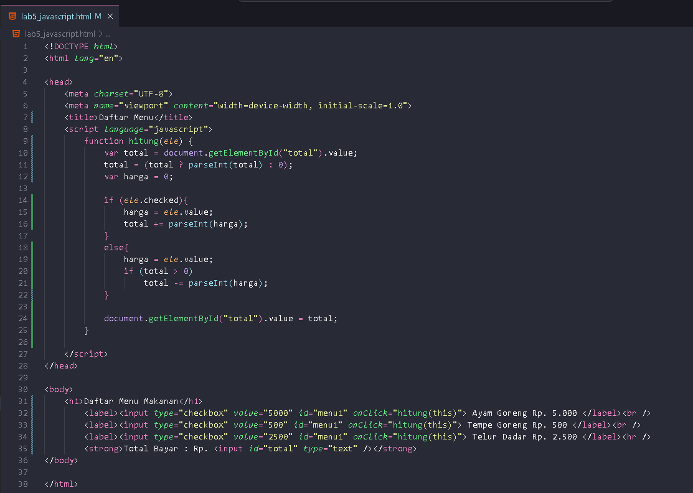
Ketika semua Checkbox di centang, itu akan memunculkan Total Harga untuk Semua Makanan
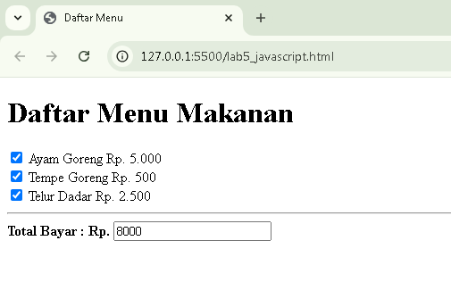
Ketika semua Checkbox tidak di centang, itu akan memunculkan 0 Rupiah pada Total Harga
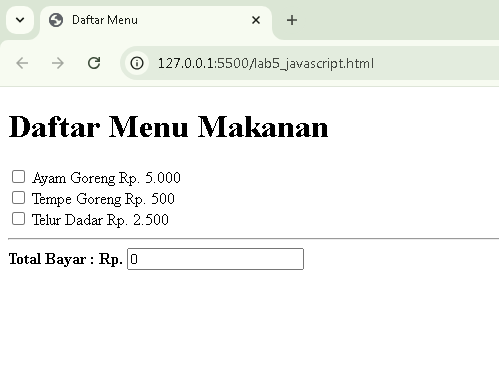

